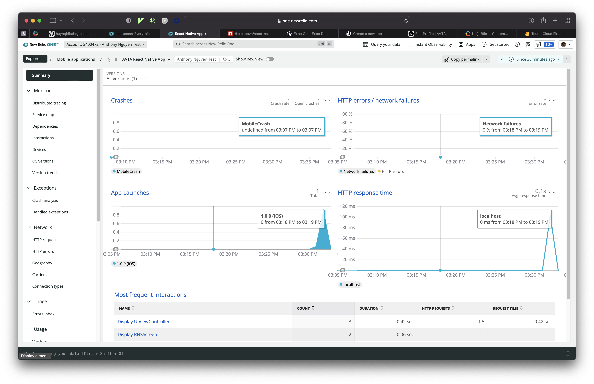
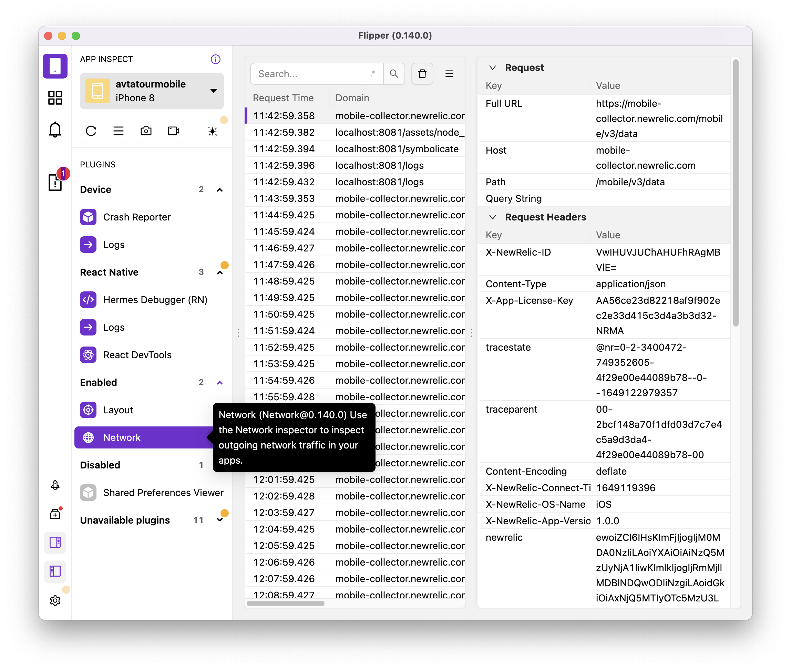

# Set up NewRelic on React Native app developed using Expo Managed workflow (Tested on iOS)

## Create a new expo app

```bash

# install Expo cli
npm install --global expo-cli

# create new expo app, select `tabs (Typescript)` template when asked
expo init weavesock-shop-mobile

# make sure you can run the app (you should see Iphone 8 simulator open showing the app)
cd weavesock-shop-mobile
npm run ios

# install npm dependencies
npm i newrelic-react-native-agent

# run expo prebuild command
expo prebuild --clean

```

## Install NewRelic Mobile Agent

-   modify the `Podfile` founder under the `ios` folder and add `pod 'NewRelicAgent'` to the first line

```bash
# from inside the ios folder
cd ios
pod install
# you should see `Installing NewRelicAgent (7.3.4)` message
```

## Register your mobile app to New Relic One

-   Login to one.newrelic.com, click on `Add More Data`, search for Mobile, select XCFramework
-   On the next screen, enter name for your app
-   Select `CocoaPods` as installation method
-   Scroll to step 4 and copy your YOUR_UNIQUE_TOKEN from this line `[NewRelic startWithApplicationToken:@"YOUR_UNIQUE_TOKEN"];`
-   Modify `index.js` root file and add the follow lines

```javascript
import * as appVesrion from './package.json';
import NewRelic from 'newrelic-react-native-agent';
NewRelic.startAgent('AA8f0d153e428310876eac4255ba2abf6f75575c78-NRMA');
NewRelic.setJSAppVersion(appVesrion.version);

registerRootComponent(App);
```

-   open XCode by running the following command

```bash
cd ios
open weavesock-shop-mobile.xcworkspace
```

-   In XCode, select your project in the navigator, then click on the application target.
-   Select Build Phases, then add a New Run Script Build Phase
-   In the script text area (beneath the Shell line) enter this script:

```bash
SCRIPT=`/usr/bin/find "${SRCROOT}" -name newrelic_postbuild.sh | head -n 1`

/bin/sh "${SCRIPT}" "YOUR_UNIQUE_TOKEN"
```

-   run your project again

```bash
# from the root folder (parent folder of ios folder)
npm run ios
```

-   open one.newrelic.com, you should see your app under `Explorer/Mobile applications`
    

## Debug React Native app using Flipper

-   Download and install the latest Flipper desktop app from https://fbflipper.com
-   Edit `Podfile` as following

```ruby
if !ENV['CI']
    use_flipper!({'Flipper' => '0.140', 'Flipper-Folly' => '2.6.10'})
end

post_install do |installer|
# make sure it is `flipper_post_install`
flipper_post_install(installer)
# other lines of code

```

-   run `pod install` again from inside the ios folder
-   run `npm run ios` again
-   open Flipper app, you should be able to see logs, network calls and the layout of your React Native app


## Deploy your app to iOS store

```bash
# install EAS tool
npm install -g eas-cli && eas login

# build IOS app, this will login to Apple Developer account, sign the app and build it in Expo Cloud
eas build --platform ios

# once done, submit the app to app store, this will guide you through the process of submitting your app to Apple App Store
eas submit -p ios
```

## Build Android version

```bash
# build AAB file which is used for submitting to Android App Store
eas build -p android

# you can also build it in APK format if you want to download and test it before submitting to the app store, check out the build profile in app.json
eas build -p android --profile preview
```
